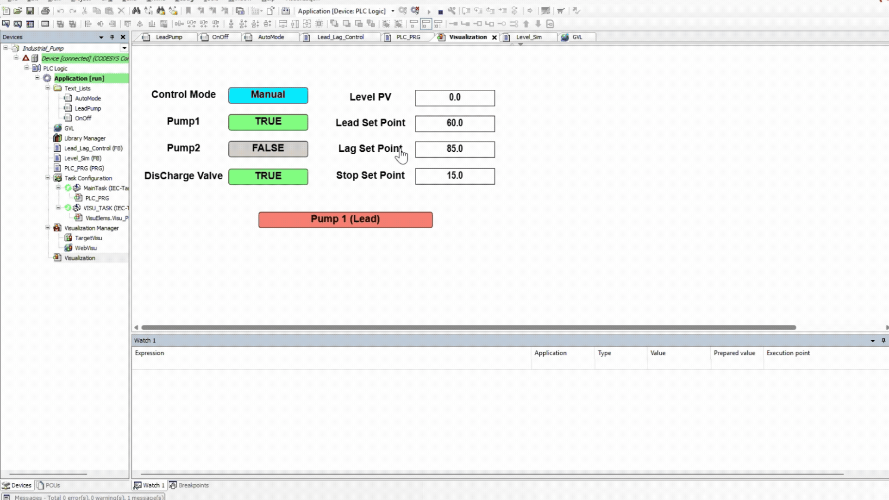

# Lead_Lag-Pump-Station

> 🚧 **Project Status:** Active Work in Progress (WIP)

## Overview
This project is a comprehensive simulation and control system for a Lead-Lag Pump Station. In industrial automation, lead-lag configurations are critical for balancing the runtime of multiple pumps, reducing mechanical wear, and ensuring system redundancy during high-demand or failure scenarios. 

This repository documents the end-to-end engineering of the system, from initial electrical/layout drafting to PLC logic programming, and eventually progressing to SCADA/dashboard integrations.

## Tech Stack & Tools
* **PLC Programming:** CODESYS (IEC 61131-3 Standard)
* **Design & Drafting:** AutoCAD
* **Communication Protocols:** Modbus (Currently Implementing)
* **Data Visualization & Analytics:** Power BI (Planned)

## Current Progress (Completed)
* **System Design:** Drafted the system architecture and electrical layouts using AutoCAD.
* **Core Logic:** Implemented the lead-lag control logic within CODESYS.
* **HMI Visualization:** Created an interactive interface to simulate pump status, tank levels, and fault conditions.
* **Runtime Balancing:** Developed the sequence to alternate the "Lead" pump after each cycle to ensure equal wear and tear.

## Next Steps (In Development)
* **Modbus Integration:** Establishing Modbus communication to allow the virtual PLC to send and receive live tag data.
* **Telemetry Logging:** Setting up data extraction pipelines for critical system metrics (e.g., pump runtimes, fault frequencies, flow rates).
* **Power BI Dashboarding:** Building a high-level analytics dashboard in Power BI to visualize the telemetry data for predictive maintenance and operational reporting.
