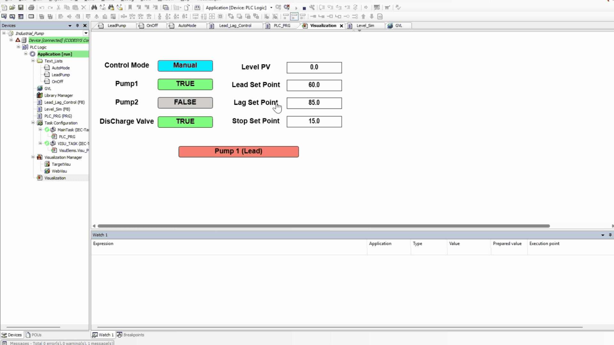
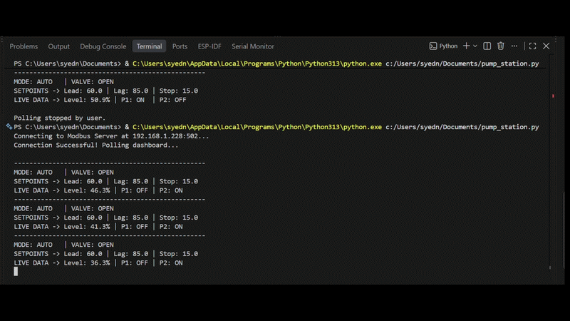

# Industrial Dual-Pump Lift Station: PLC Control & IT/OT SCADA Integration

### 🖥️ Local HMI Visualization (CODESYS)

### 📡 Live IT/OT SCADA Telemetry (Python Modbus Client)

## Overview
This project is a comprehensive industrial automation and IT/OT integration simulation for a dual-pump lift station. In municipal water and industrial fluid systems, lead-lag configurations are critical for balancing the runtime of multiple pumps, reducing mechanical wear, and ensuring system redundancy.

This repository documents the end-to-end engineering of the system: from the IEC 61131-3 PLC control architecture and simulated plant physics, to a fully functional Modbus TCP server and a custom Python SCADA client bridging the operational hardware to the IT network.

## System Architecture & Data Flow
1. **The Control Layer (CODESYS):** A virtual PLC executes a modular IEC 61131-3 Structured Text program. It runs a closed-loop simulation of tank fill/drain physics while executing the `fb_LeadLag_Control` Function Block. The logic dictates deadband hysteresis, dynamic setpoints, and alternating pump duty cycles to ensure even mechanical wear.
2. **The Network Layer (Modbus TCP):** The PLC is configured as a local Modbus TCP Server. To optimize network bandwidth, analog float values (Tank Level, Setpoints) are scaled to 16-bit integers (`REAL_TO_UINT`), and discrete boolean states (Pump 1, Pump 2, Valve, Auto Mode) are bit-packed into a single Modbus holding register (`%QW0`).
3. **The IT/OT Bridge (Python SCADA):** A custom Python script utilizing the `pymodbus` library acts as the SCADA client. It polls the PLC's memory registers over the network at 1Hz, unpacks the bit-level data, reverses the integer scaling, and dynamically generates a live telemetry dashboard in the terminal (as seen in the demonstration above). 

## Tech Stack & Tools
* **PLC Programming & Simulation:** CODESYS V3.5 (IEC 61131-3 Structured Text)
* **IT/OT Networking:** Modbus TCP/IP
* **SCADA / Telemetry Client:** Python 3 (`pymodbus`)
* **Design & Drafting:** AutoCAD Electrical

## Key Engineering Features
* **Modular IEC 61131-3 Architecture:** Strict separation between the Plant Physics Simulator and the Lead/Lag Controller, mimicking professional digital-twin and hardware-in-the-loop (HIL) testing.
* **Process Control & Wear-Leveling:** Implemented multi-tier hysteresis and dynamic lead/lag arbitration to protect multi-thousand-dollar pumps from short-cycling.
* **Industrial Data Optimization:** Showcases real-world memory map management through bit-packing actuator states and scaling floating-point numbers for Modbus transmission.
* **IT/OT Convergence:** Successfully bridged the Operational Technology (OT) hardware logic with an Information Technology (IT) software pipeline, demonstrating the foundational skills required for IIoT and modern smart-manufacturing roles.
